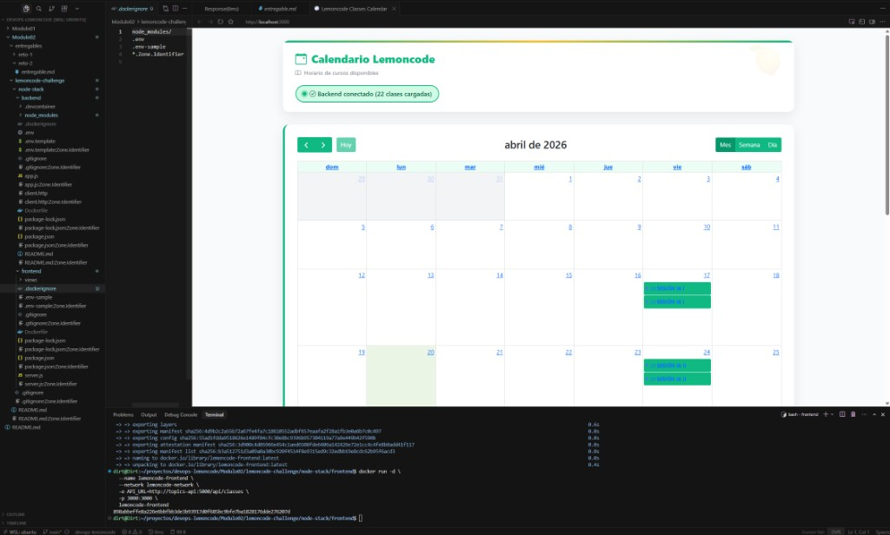

# Entregable Reto 3: Dockerizar el Frontend

## 1. Dockerfile del frontend

Ubicación: `node-stack/frontend/Dockerfile`

```dockerfile
FROM node:20-alpine

WORKDIR /app

COPY package*.json ./

RUN npm install --omit=dev

COPY server.js .
COPY views/ ./views/

EXPOSE 3000

CMD ["node", "server.js"]
```

## 2. Comando para construir la imagen del frontend

```bash
docker build -t lemoncode-frontend .
```

## 3. Comando para ejecutar el contenedor del frontend

```bash
docker run -d \
  --name lemoncode-frontend \
  --network lemoncode-network \
  -e API_URL=http://topics-api:5000/api/classes \
  -p 3000:3000 \
  lemoncode-frontend
```

## 4. Variables de entorno configuradas

Archivo `.env` en `node-stack/frontend/`:

```
API_URL=http://topics-api:5000/api/classes
```

Apunta al contenedor del backend usando su nombre dentro de la red Docker.

## Verificación

Output de `docker logs lemoncode-frontend`, mostrando que el frontend arranca y se conecta al backend correctamente:

```
======================================================================
🍋 LEMONCODE CALENDAR - FRONTEND SERVER
======================================================================
🚀 Servidor iniciado correctamente
📱 Web: http://localhost:3000
🔗 API: http://topics-api:5000/api/classes
⏰ Hora: 20/4/2026, 14:37:58
======================================================================

📍 [14:38:09] GET /
🔄 Conectando a la API: http://topics-api:5000/api/classes
✅ 22 clases cargadas correctamente
```

Aplicación funcionando en `http://localhost:3000`:


